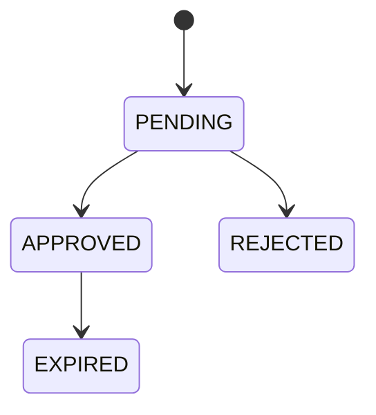

# Approvals API

Manage just-in-time approval requests.

Requests are typically created by the platform when policy evaluation returns `approval_required` for a tool call.

---

## Create Access Request

<span class="method-post">POST</span> <span class="endpoint">/governance/requests</span>

Creates a new request. Idempotent for the same pending `subject + tool_id` pair.

### Request Body

| Field | Type | Required | Description |
|-------|------|----------|-------------|
| `subject` | string | Yes | Requesting identity (user or service) |
| `tool_id` | string | Yes | Tool name |
| `agent_id` | string | No | Agent service account / agent name |
| `duration` | string | No | Requested TTL (e.g. `4h`) |
| `run_id` | string | No | Run ID for pause/resume linkage |
| `capability` | string | No | Capability name |
| `payload_hash` | string | No | Payload integrity hash |
| `tool_method` | string | No | HTTP method of blocked call |
| `tool_url` | string | No | Full blocked URL |

### Response

- `201 Created` for a new request
- `200 OK` when returning an existing pending request

```json
{
  "id": "req-a1b2c3",
  "status": "PENDING",
  "action_id": "act-x1y2z3"
}
```

---

## List Requests

<span class="method-get">GET</span> <span class="endpoint">/governance/requests</span>

### Query Parameters

| Parameter | Type | Description |
|-----------|------|-------------|
| `status` | string | Filter: `PENDING`, `APPROVED`, `REJECTED`, `EXPIRED` |

### Response

```json
[
  {
    "id": "req-a1b2c3",
    "subject": "alice@example.com",
    "agent_id": "billing-agent",
    "tool_id": "stripe-api",
    "status": "PENDING",
    "duration": "4h",
    "created_at": "2026-03-12T12:00:00Z",
    "updated_at": "2026-03-12T12:00:00Z"
  }
]
```

---

## Get Request

<span class="method-get">GET</span> <span class="endpoint">/governance/requests/:id</span>

Returns the full request record.

---

## Approve Request

<span class="method-post">POST</span> <span class="endpoint">/governance/requests/:id/approve</span>

Approves a pending request.

On approval, RunAgents creates a temporary allow policy + policy binding and sets `expires_at`.

### Optional Body

| Field | Type | Required | Description |
|-------|------|----------|-------------|
| `duration` | string | No | Override TTL for this approval |
| `reason` | string | No | Approval note |

### Response

```json
{
  "id": "req-a1b2c3",
  "status": "APPROVED",
  "approver_id": "admin@example.com",
  "duration": "4h",
  "expires_at": "2026-03-12T16:00:00Z"
}
```

---

## Reject Request

<span class="method-post">POST</span> <span class="endpoint">/governance/requests/:id/reject</span>

Rejects a pending request.

### Optional Body

| Field | Type | Required | Description |
|-------|------|----------|-------------|
| `reason` | string | No | Rejection reason |

### Response

```json
{
  "id": "req-a1b2c3",
  "status": "REJECTED",
  "reason": "Not approved for production writes"
}
```

---

## Lifecycle



`EXPIRED` is set when the temporary grant TTL elapses and cleanup runs.

---

## Errors

| Status | Meaning |
|--------|---------|
| `400` | Invalid request body |
| `404` | Request not found |
| `409` | Request is not in a mutable state |

---

## Notes

- Approval triggering is policy-driven (`approval_required`), not tool `requireApproval` flags.
- When `run_id` is present, approvals integrate with run pause/resume and blocked actions.
