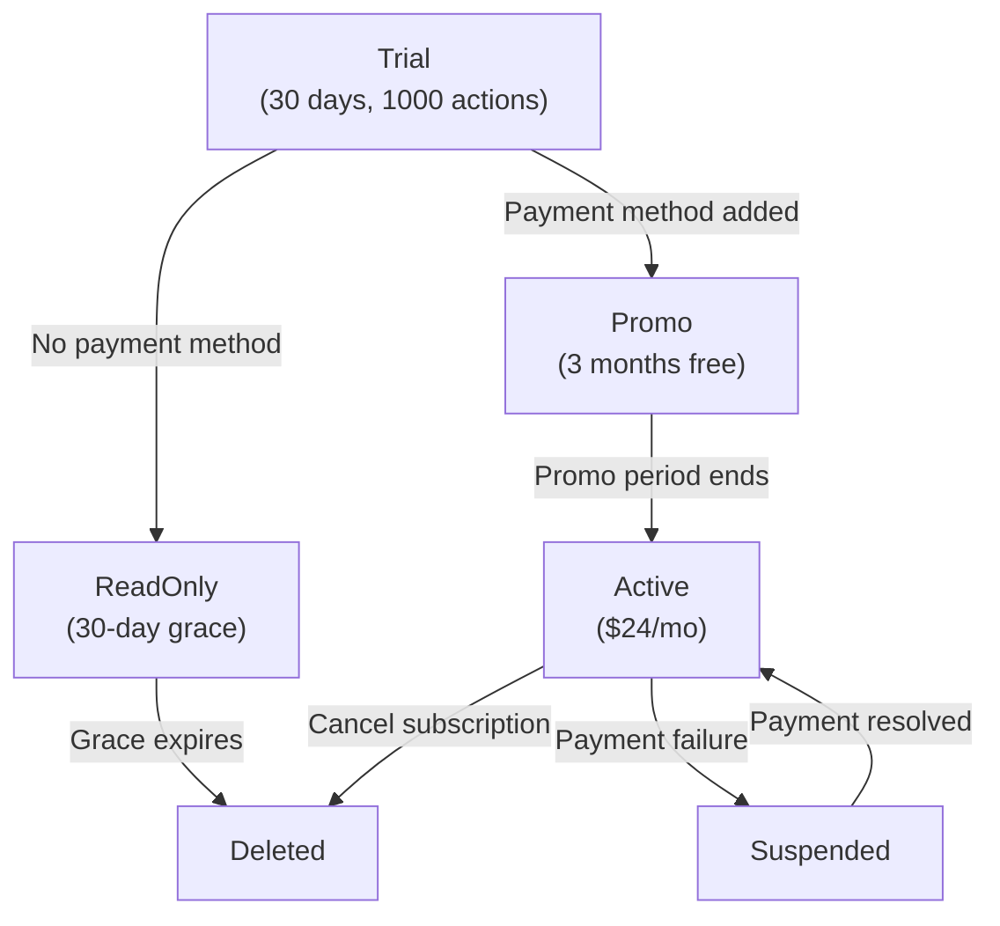

# Billing API

Manage workspace billing, metering, and payment methods. The billing API tracks action usage against plan limits, handles payment method collection via Stripe, and manages plan lifecycle transitions from trial through active subscription.

--8<-- "api-links/billing.md"

---

## Get Billing Status

<span class="method-get">GET</span> <span class="endpoint">/api/billing</span>

Returns the current billing status for the workspace, including plan state, usage counters, and payment method status.

=== "curl"

    ```bash
    curl https://api.runagents.io/api/billing \
      -H "Authorization: Bearer $RUNAGENTS_API_KEY"
    ```

=== "Python"

    ```python
    import requests

    resp = requests.get(
        "https://api.runagents.io/api/billing",
        headers={"Authorization": f"Bearer {api_key}"},
    )
    print(resp.json())
    ```

### Response (200 OK)

```json
{
  "plan_status": "trial",
  "actions_used": 142,
  "actions_limit": 1000,
  "period_start": "2026-03-01T00:00:00Z",
  "period_end": "2026-03-31T00:00:00Z",
  "days_remaining": 24,
  "has_payment_method": false
}
```

### Response Fields

| Field | Type | Description |
|-------|------|-------------|
| `plan_status` | string | Current plan state: `trial`, `promo`, `active`, `readonly`, `suspended`, or `deleted` |
| `actions_used` | integer | Number of actions consumed in the current billing period |
| `actions_limit` | integer | Maximum actions allowed in the current billing period |
| `period_start` | string | ISO 8601 timestamp for the start of the current billing period |
| `period_end` | string | ISO 8601 timestamp for the end of the current billing period |
| `days_remaining` | integer | Days remaining in the current period |
| `has_payment_method` | boolean | Whether a valid payment method is attached to the workspace |

---

## Get Daily Usage

<span class="method-get">GET</span> <span class="endpoint">/api/billing/usage/daily</span>

Returns daily action usage for the last 30 days. Useful for rendering usage charts and identifying consumption trends.

=== "curl"

    ```bash
    curl https://api.runagents.io/api/billing/usage/daily \
      -H "Authorization: Bearer $RUNAGENTS_API_KEY"
    ```

=== "Python"

    ```python
    import requests

    resp = requests.get(
        "https://api.runagents.io/api/billing/usage/daily",
        headers={"Authorization": f"Bearer {api_key}"},
    )
    print(resp.json())
    ```

### Response (200 OK)

```json
[
  {"date": "2026-03-06", "count": 47},
  {"date": "2026-03-05", "count": 63},
  {"date": "2026-03-04", "count": 32}
]
```

### Response Fields (per entry)

| Field | Type | Description |
|-------|------|-------------|
| `date` | string | Date in `YYYY-MM-DD` format |
| `count` | integer | Number of actions executed on that date |

---

## Create Setup Intent

<span class="method-post">POST</span> <span class="endpoint">/api/billing/setup-intent</span>

Creates a Stripe SetupIntent for securely collecting a payment method. Use the returned `client_secret` with Stripe Elements on the frontend to confirm the card details without charging the user.

=== "curl"

    ```bash
    curl -X POST https://api.runagents.io/api/billing/setup-intent \
      -H "Authorization: Bearer $RUNAGENTS_API_KEY"
    ```

=== "Python"

    ```python
    import requests

    resp = requests.post(
        "https://api.runagents.io/api/billing/setup-intent",
        headers={"Authorization": f"Bearer {api_key}"},
    )
    print(resp.json())
    ```

### Response (200 OK)

```json
{
  "client_secret": "seti_1N4k7p2eZvKYlo2C0lR3Pz5v_secret_OdN2LqKxvEqs2mYmKa0z7pM3sGnOA1L"
}
```

### Response Fields

| Field | Type | Description |
|-------|------|-------------|
| `client_secret` | string | Stripe SetupIntent client secret for frontend confirmation |

!!! tip
    Pass the `client_secret` to `stripe.confirmCardSetup()` in your frontend. After successful confirmation, call the [Attach Payment Method](#attach-payment-method) endpoint with the resulting `payment_method_id`.

---

## Attach Payment Method

<span class="method-post">POST</span> <span class="endpoint">/api/billing/payment-method</span>

Attaches a payment method to the workspace after a SetupIntent has been confirmed on the frontend. For workspaces on the `trial` plan, this automatically transitions the plan to `promo` (3 months free).

### Request Body

| Field | Type | Required | Description |
|-------|------|----------|-------------|
| `payment_method_id` | string | Yes | Stripe PaymentMethod ID from the confirmed SetupIntent |

=== "curl"

    ```bash
    curl -X POST https://api.runagents.io/api/billing/payment-method \
      -H "Authorization: Bearer $RUNAGENTS_API_KEY" \
      -H "Content-Type: application/json" \
      -d '{"payment_method_id": "pm_1N4k8q2eZvKYlo2CkFz7Ob3E"}'
    ```

=== "Python"

    ```python
    import requests

    resp = requests.post(
        "https://api.runagents.io/api/billing/payment-method",
        headers={"Authorization": f"Bearer {api_key}"},
        json={"payment_method_id": "pm_1N4k8q2eZvKYlo2CkFz7Ob3E"},
    )
    print(resp.json())
    ```

### Response (200 OK)

```json
{
  "status": "promo"
}
```

### Response Fields

| Field | Type | Description |
|-------|------|-------------|
| `status` | string | The new plan status after attaching the payment method |

!!! info
    If the workspace is already on `promo` or `active`, the payment method is updated but the plan status does not change.

---

## Create Checkout Session

<span class="method-post">POST</span> <span class="endpoint">/api/billing/subscribe</span>

Creates a Stripe Checkout session for subscribing to a paid plan. Redirects the user to Stripe's hosted checkout page.

### Request Body

| Field | Type | Required | Description |
|-------|------|----------|-------------|
| `success_url` | string | Yes | URL to redirect to after successful checkout |
| `cancel_url` | string | Yes | URL to redirect to if the user cancels checkout |

=== "curl"

    ```bash
    curl -X POST https://api.runagents.io/api/billing/subscribe \
      -H "Authorization: Bearer $RUNAGENTS_API_KEY" \
      -H "Content-Type: application/json" \
      -d '{
        "success_url": "https://app.runagents.io/settings?billing=success",
        "cancel_url": "https://app.runagents.io/settings?billing=cancel"
      }'
    ```

=== "Python"

    ```python
    import requests

    resp = requests.post(
        "https://api.runagents.io/api/billing/subscribe",
        headers={"Authorization": f"Bearer {api_key}"},
        json={
            "success_url": "https://app.runagents.io/settings?billing=success",
            "cancel_url": "https://app.runagents.io/settings?billing=cancel",
        },
    )
    print(resp.json())
    ```

### Response (200 OK)

```json
{
  "url": "https://checkout.stripe.com/c/pay/cs_live_a1b2c3d4..."
}
```

### Response Fields

| Field | Type | Description |
|-------|------|-------------|
| `url` | string | Stripe Checkout URL to redirect the user to |

---

## Create Billing Portal Session

<span class="method-post">POST</span> <span class="endpoint">/api/billing/portal</span>

Creates a Stripe Billing Portal session. The portal allows users to manage their subscription, update payment methods, and view invoice history.

### Request Body

| Field | Type | Required | Description |
|-------|------|----------|-------------|
| `return_url` | string | Yes | URL to redirect to when the user exits the portal |

=== "curl"

    ```bash
    curl -X POST https://api.runagents.io/api/billing/portal \
      -H "Authorization: Bearer $RUNAGENTS_API_KEY" \
      -H "Content-Type: application/json" \
      -d '{"return_url": "https://app.runagents.io/settings"}'
    ```

=== "Python"

    ```python
    import requests

    resp = requests.post(
        "https://api.runagents.io/api/billing/portal",
        headers={"Authorization": f"Bearer {api_key}"},
        json={"return_url": "https://app.runagents.io/settings"},
    )
    print(resp.json())
    ```

### Response (200 OK)

```json
{
  "url": "https://billing.stripe.com/p/session/live_a1b2c3d4..."
}
```

### Response Fields

| Field | Type | Description |
|-------|------|-------------|
| `url` | string | Stripe Billing Portal URL to redirect the user to |

---

## Get Publishable Key

<span class="method-get">GET</span> <span class="endpoint">/api/billing/publishable-key</span>

Returns the Stripe publishable key for initializing Stripe Elements on the frontend. This key is safe to expose in client-side code.

=== "curl"

    ```bash
    curl https://api.runagents.io/api/billing/publishable-key \
      -H "Authorization: Bearer $RUNAGENTS_API_KEY"
    ```

=== "Python"

    ```python
    import requests

    resp = requests.get(
        "https://api.runagents.io/api/billing/publishable-key",
        headers={"Authorization": f"Bearer {api_key}"},
    )
    print(resp.json())
    ```

### Response (200 OK)

```json
{
  "publishable_key": "pk_live_51N4k7p2eZvKYlo2C..."
}
```

### Response Fields

| Field | Type | Description |
|-------|------|-------------|
| `publishable_key` | string | Stripe publishable key for frontend use |

---

## Plan Lifecycle

Workspace plans follow a state machine with automatic transitions based on time, usage, and payment events.



### Transitions

| From | To | Trigger |
|------|----|---------|
| `trial` | `promo` | Payment method attached via `/api/billing/payment-method` |
| `trial` | `readonly` | Trial period (30 days) or action limit (1,000) exceeded without a payment method |
| `promo` | `active` | Promotional period (3 months) expires; first charge at $24/month |
| `active` | `suspended` | Stripe payment fails (card declined, expired, etc.) |
| `active` | `deleted` | User cancels subscription via Stripe Billing Portal |
| `readonly` | `deleted` | Grace period (30 days) expires without a payment method being added |
| `suspended` | `active` | Payment method updated and outstanding invoice paid |

!!! warning
    In `readonly` status, existing agents continue running but new deployments and configuration changes are blocked. In `suspended` status, all agent execution is paused until payment is resolved.

---

## Plan Status Reference

| Status | Description | Agent Execution | New Deployments | Duration |
|--------|-------------|-----------------|-----------------|----------|
| `trial` | Free trial period | Yes | Yes | 30 days or 1,000 actions |
| `promo` | Promotional period after adding payment method | Yes | Yes | 3 months |
| `active` | Paid subscription | Yes | Yes | Ongoing ($24/month) |
| `readonly` | Trial expired, grace period | Yes (existing only) | No | 30 days |
| `suspended` | Payment failed | No | No | Until payment resolved |
| `deleted` | Workspace deactivated | No | No | Permanent |
