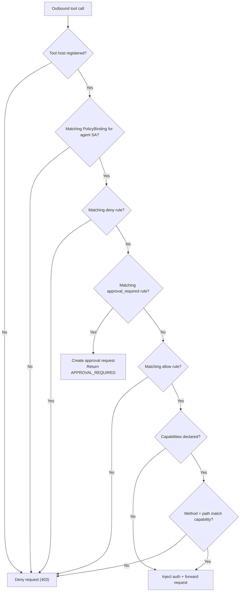

# Policy Model

RunAgents evaluates every outbound agent-to-tool call against policy. Access is **deny by default**, and approvals are triggered by policy rules (`approval_required`) rather than legacy tool flags.

---

## Runtime Source Of Truth

At runtime, policy decisions are made in this order:

1. **Tool match**: Destination host must match a registered tool, otherwise the call is denied.
2. **Policy binding lookup**: Find policies bound to the agent ServiceAccount.
3. **Policy rule evaluation** (for matching resource/tags + HTTP method):
    - `deny` wins immediately
    - otherwise `approval_required`
    - otherwise `allow`
    - otherwise deny
4. **Capability check**: If tool capabilities are defined, method+path must match.
5. **Auth injection + forward**: Only after policy and capability checks pass.



!!! info "Current identity scope"
    Runtime policy evaluation is currently driven by the **agent ServiceAccount** identity.

---

## Policy Rules

A policy defines access behavior through `spec.policies` rules.

```yaml
apiVersion: platform.ai/v1alpha1
kind: Policy
metadata:
  name: payments-access
spec:
  policies:
    - permission: allow
      resource: https://api.stripe.com/*
      operations: [GET]
    - permission: approval_required
      tags: [financial]
      operations: [POST]
    - permission: deny
      resource: https://api.stripe.com/*
      operations: [DELETE]
```

| Field | Description |
|---|---|
| `permission` | `allow`, `deny`, or `approval_required` |
| `resource` | URL pattern, supports wildcard suffix (e.g. `https://api.stripe.com/*`) |
| `operations` | Optional HTTP methods. Empty means all methods. |
| `tags` | Optional tool risk tags. Rule matches if any listed tag is on the tool. |

!!! warning "Precedence"
    Decision precedence is always: **`deny` > `approval_required` > `allow` > default deny**.

---

## Policy Bindings

A policy binding connects policies to an agent identity:

```yaml
apiVersion: platform.ai/v1alpha1
kind: PolicyBinding
metadata:
  name: billing-agent-payments-access
spec:
  policyRef:
    name: payments-access
  subjects:
    - kind: ServiceAccount
      name: billing-agent
```

Use bindings to decide which policies apply to each deployed agent.

---

## Approval Routing In Policy

Approval authority and delivery are configured in `spec.approvals` on a Policy.

```yaml
spec:
  approvals:
    - name: financial-posts
      tags: [financial]
      operations: [POST]
      approvers:
        groups: [finance-approvers]
        match: any
      defaultDuration: 4h
      delivery:
        connectors: [slack-finance]
        mode: first_success
        fallbackToUI: true
```

This controls:

- who can approve (`approvers.groups`)
- how group matching works (`any` or `all`)
- default approval TTL (`defaultDuration`)
- where requests are sent (connectors / fallback)

---

## Just-In-Time Approval Flow

When a matching policy rule returns `approval_required`:

1. The call is blocked with `403` and `code=APPROVAL_REQUIRED`.
2. An access request is created.
3. If the call is part of a run, the run moves to `PAUSED_APPROVAL`.
4. On approval, RunAgents creates a temporary allow policy + binding and resumes work.
5. On expiry, that temporary grant is cleaned up automatically.

---

## Capabilities Are A Second Guardrail

Capabilities are operation allow-lists on tools. They are checked **after** policy allow/approval resolution.

- If capabilities are defined, non-matching method/path requests are denied.
- If capabilities are empty, capability filtering is skipped.

This lets you combine broad policy resources with strict operation-level controls.

---

## About Tool Access Control Fields

Tool `governance.accessControl.mode` is still present for UI/default posture, but runtime authorization is policy-driven.

`governance.accessControl.requireApproval` is deprecated for runtime authorization; use policy rules with `permission: approval_required`.

---

## Recommended Pattern

1. Register tools with accurate base URL, auth, capabilities, and risk tags.
2. Create policies that express allow/deny/approval-required behavior.
3. Bind policies to agent ServiceAccounts during deploy.
4. Add approval rules (`spec.approvals`) for approver groups and connector routing.
5. Verify behavior with run timelines and approval logs.

---

## Next Steps

- [Approvals](../platform/approvals.md)
- [Registering Tools](../platform/registering-tools.md)
- [Architecture](architecture.md)
- [Run Lifecycle](../operations/runs.md)
