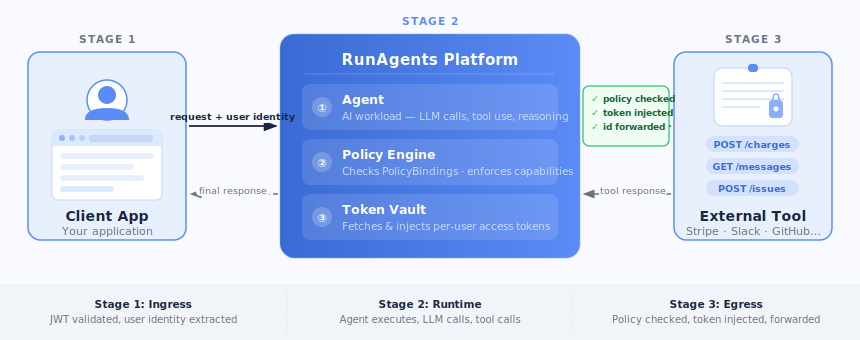

<!-- ── HERO ─────────────────────────────────────────────────────────────── -->
<div class="ra-hero">
  <h1>Deploy AI Agents<br>That Act Securely</h1>
  <p>Upload your agent code. Wire it to tools and LLMs. RunAgents enforces identity, access policy, and approval workflows — transparently, with zero code changes.</p>
  <p style="margin-top:-0.75rem;font-size:0.95rem;opacity:0.82">Use the same governed runtime behind a web app, WhatsApp, Slack, an internal portal, or a custom client.</p>
  <div class="ra-hero-buttons">
    <a href="https://try.runagents.io" class="ra-btn-primary">Start Free Trial</a>
    <a href="getting-started/quickstart/" class="ra-btn-secondary">5-Min Quickstart →</a>
    <a href="getting-started/cli-quickstart/" class="ra-btn-secondary">CLI Docs →</a>
  </div>
</div>

<!-- ── STATS BAR ─────────────────────────────────────────────────────────── -->
<div class="ra-stats-bar">
  <div class="ra-stat">
    <span class="ra-stat-num">5 min</span>
    <span class="ra-stat-label">Time to first<br>running agent</span>
  </div>
  <div class="ra-stat">
    <span class="ra-stat-num">0</span>
    <span class="ra-stat-label">Lines of security<br>code to write</span>
  </div>
  <div class="ra-stat">
    <span class="ra-stat-num">100%</span>
    <span class="ra-stat-label">Tool calls<br>policy-checked</span>
  </div>
  <div class="ra-stat">
    <span class="ra-stat-num">4</span>
    <span class="ra-stat-label">LLM providers<br>supported</span>
  </div>
</div>

---

<!-- ── WHAT'S NEW ────────────────────────────────────────────────────────── -->
<p class="ra-flow-label">New in April 2026</p>
<p class="ra-section-heading">Scoped approvals, clearer operations, and stronger messaging workflows</p>
<p class="ra-section-sub">RunAgents now supports scoped approval choices, a cleaner approval-versus-consent operating model, and more reliable pause-and-resume behavior for governed workflows.</p>

<div class="grid cards" markdown>

-   :material-clipboard-check-outline:{ .lg .middle } **Scoped approvals**

    ---

    Approve one action, one run, or a short-lived user/agent/tool work window for governed writes.

-   :material-google:{ .lg .middle } **Google Workspace writes**

    ---

    Use policy-controlled Google Calendar event creation alongside delegated-user OAuth and approval workflows.

-   :material-message-text-fast:{ .lg .middle } **Better pause and resume**

    ---

    Approval and consent workflows resume more cleanly across the console and messaging surfaces such as WhatsApp.

</div>

<div style="margin:1rem 0 2rem">
  <a href="whats-new/releases/2026-04-09-scoped-approvals-console-messaging/" class="md-button md-button--primary">Read the latest release notes</a>
</div>

<figure class="ra-shot">
  
  <figcaption>The updated operator view separates pending approvals from pending consents and makes current workspace state easier to scan.</figcaption>
</figure>

---

<!-- ── FEATURES GRID ──────────────────────────────────────────────────────── -->
<p class="ra-flow-label">Platform capabilities</p>
<p class="ra-section-heading">Everything your agent needs to act safely in production</p>
<p class="ra-section-sub">From deploy to approval workflows — the full stack for production-grade AI agents.</p>

<div class="grid cards" markdown>

-   :material-rocket-launch:{ .lg .middle } **5-Minute Deploy**

    ---

    Upload Python or TypeScript, auto-detect tools and models, wire, deploy. No Dockerfile, no Kubernetes, no infra.

    [:octicons-arrow-right-24: Quickstart](getting-started/quickstart.md)

-   :material-bookshelf:{ .lg .middle } **Agent Catalog**

    ---

    Start from maintained production-style blueprints such as the Google Workspace assistant when you want to validate real policy, approval, and OAuth flows.

    [:octicons-arrow-right-24: Agent Catalog](platform/agent-catalog.md)

-   :material-console-line:{ .lg .middle } **CLI & Natural Language Copilot**

    ---

    `runagents copilot` — deploy and manage agents by describing what you want. Works in any terminal.

    [:octicons-arrow-right-24: CLI & Copilot](getting-started/copilot.md)

-   :material-message-outline:{ .lg .middle } **Any Interface**

    ---

    Put the same agent behind a web app, WhatsApp, Slack, or a custom internal UI. RunAgents handles execution, policy, identity, and approvals behind the surface.

    [:octicons-arrow-right-24: Architecture](concepts/architecture.md)

-   :material-robot-outline:{ .lg .middle } **Claude Code · Codex · Cursor**

    ---

    Generate a structured action plan with your AI coding tool, validate it, apply it — no console needed.

    [:octicons-arrow-right-24: Deploy from AI tools](getting-started/deploy-from-ai-tools.md)

-   :material-shield-check-outline:{ .lg .middle } **Just-In-Time Approvals**

    ---

    High-risk tool calls pause the agent and notify reviewers via Slack, PagerDuty, Teams, or Jira.

    [:octicons-arrow-right-24: Approvals](platform/approvals.md)

-   :material-lock-outline:{ .lg .middle } **Zero-Trust Policy Engine**

    ---

    Every outbound call is authorized. Policies enforce method + path restrictions on every agent identity.

    [:octicons-arrow-right-24: Policy model](concepts/policy-model.md)

-   :material-chart-timeline-variant:{ .lg .middle } **Full Run Observability**

    ---

    Structured audit trail per run — user messages, tool calls, approvals — exportable to Splunk, Datadog, ECS.

    [:octicons-arrow-right-24: Run lifecycle](operations/runs.md)

</div>

---

<!-- ── ARCHITECTURE ──────────────────────────────────────────────────────── -->
<p class="ra-flow-label">Architecture</p>
<p class="ra-section-heading">Three-stage secure request flow</p>
<p class="ra-section-sub">Every agent invocation moves through ingress → runtime → egress, with identity and policy enforced at each stage.</p>



<div class="grid cards" markdown style="margin-top:1.5rem">

-   :material-shield-account:{ .middle } **Stage 1 · Ingress**

    JWT validated at the edge. User identity extracted and forwarded as `X-End-User-ID` header through the entire call chain.

-   :material-cpu-64-bit:{ .middle } **Stage 2 · Runtime**

    Agent executes — LLM calls route through the gateway, tool calls route through the policy engine. Logs structured events per turn.

-   :material-transit-connection-variant:{ .middle } **Stage 3 · Egress**

    Every outbound call intercepted: identity verified, policy evaluated, OAuth token injected. Approval workflows triggered on deny.

</div>

[:octicons-arrow-right-24: Read the full architecture guide](concepts/architecture.md){ .md-button }

---

<!-- ── THREE PILLARS ─────────────────────────────────────────────────────── -->
<p class="ra-flow-label">Core concepts</p>
<p class="ra-section-heading">Security is the default, not an add-on</p>

=== ":material-account-arrow-right: Identity Propagation"

    The user who triggered the agent is identified at ingress. That identity travels — unchanged — to every tool the agent calls.

    - JWT validated and unpacked at the platform edge
    - `X-End-User-ID` header forwarded automatically to all downstream tools
    - External APIs see the real end-user, not a shared service account
    - Full traceability: every tool call is linked to a real human identity

    [Learn more about identity propagation :octicons-arrow-right-24:](concepts/identity-propagation.md)

=== ":material-shield-lock: Policy-Driven Access"

    Agents can only call tools they have been explicitly granted access to. Policies enforce not just which tools, but which operations.

    - Policies define URL/tag rules with `allow`, `deny`, or `approval_required`
    - Capability checks enforce method + path level (`POST /charges` vs `GET /customers`)
    - Default posture is deny unless a bound policy explicitly allows access
    - Approval workflows are triggered by policy rules, not by legacy tool flags

    [Learn more about the policy model :octicons-arrow-right-24:](concepts/policy-model.md)

=== ":material-clipboard-check-outline: Just-In-Time Approvals"

    High-risk operations pause the agent. An admin reviews the exact payload, approves or rejects, and the platform auto-resumes.

    - Payload hash verification — the approved request must match exactly what the agent sends
    - Notification via Slack (with OIDC identity linking), PagerDuty, Teams, or Jira
    - Time-limited grants — access expires after a configurable TTL
    - Full resume automation — no manual re-triggering after approval

    [Learn more about approvals :octicons-arrow-right-24:](platform/approvals.md)

---

<!-- ── TERMINAL QUICKSTART ───────────────────────────────────────────────── -->
<p class="ra-flow-label">Get started in seconds</p>
<p class="ra-section-heading">One command to deploy from the terminal</p>

<div class="ra-terminal">
  <div class="ra-terminal-bar">
    <span class="ra-dot ra-dot-r"></span>
    <span class="ra-dot ra-dot-y"></span>
    <span class="ra-dot ra-dot-g"></span>
    <span class="ra-terminal-label">Terminal</span>
  </div>

```text
# Install
curl -fsSL https://runagents-releases.s3.amazonaws.com/cli/install.sh | sh

# Configure
runagents config set endpoint https://your-workspace.try.runagents.io
runagents config set api-key YOUR_API_KEY

# Deploy with natural language
runagents copilot
> deploy this folder as billing-agent

  Analyzing source files...
  ✓ Detected: stripe tool, gpt-4o-mini model
  ✓ Tool registered: stripe
  ✓ Agent deployed: billing-agent (Running)
```

</div>

<div style="text-align:center;margin:1rem 0 0">
<a href="getting-started/cli-quickstart/" class="md-button">Full CLI guide</a>&nbsp;&nbsp;
<a href="getting-started/quickstart/" class="md-button">Console quickstart</a>&nbsp;&nbsp;
<a href="getting-started/deploy-from-ai-tools/" class="md-button">Deploy from Claude Code</a>
</div>

---

<!-- ── BOTTOM CTA ─────────────────────────────────────────────────────────── -->
<div style="text-align:center;padding:2rem 0 0.5rem">
  <p class="ra-section-heading">Ready to deploy your first agent?</p>
  <p class="ra-section-sub">Free trial. No credit card. Running in 5 minutes.</p>
</div>

<div class="ra-cta-row">
  <a href="https://try.runagents.io" class="ra-btn-cta">Start Free Trial</a>
  <a href="getting-started/quickstart/" class="ra-btn-outline">Read the Quickstart</a>
</div>

<div style="text-align:center;margin-top:1.5rem">
<small style="color:var(--ra-ink-muted)">© 2026 RunAgents, Inc. &nbsp;·&nbsp; <a href="https://runagents.io/privacy">Privacy</a> &nbsp;·&nbsp; <a href="https://runagents.io/terms">Terms</a> &nbsp;·&nbsp; <a href="https://github.com/runagents-io/runagents">GitHub</a></small>
</div>
