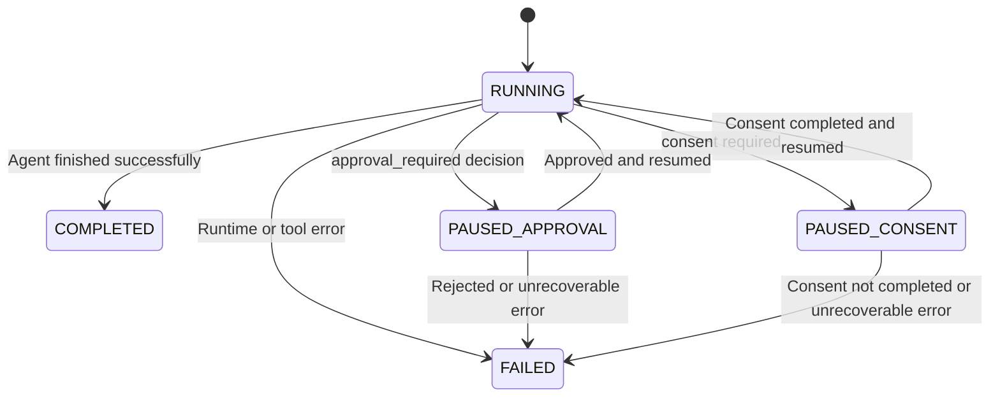

# Run Lifecycle

A **run** represents one end-to-end execution of an agent, from the initial request to completion. RunAgents tracks each run through a defined state machine, logs events, and coordinates approval or consent when a governed tool call cannot continue immediately.

---

## Creating a run

Runs are created when an agent is invoked through:

- a client application
- an API call to the agent's invoke URL
- a background trigger or scheduled invocation

Each run is assigned a unique ID and begins in the `RUNNING` state.

---

## Run states

| Status | Description |
|---|---|
| `RUNNING` | The agent is actively executing |
| `PAUSED_APPROVAL` | The agent hit a governed action that requires approval |
| `PAUSED_CONSENT` | The agent needs the end user to complete or refresh OAuth consent |
| `COMPLETED` | The agent finished successfully |
| `FAILED` | The agent encountered an error or could not continue |

### State transitions



!!! info "Forward-only state changes"
    Completed and failed runs are terminal. Paused runs resume into `RUNNING` only when the blocking condition is resolved.

---

## Events

Every run has an ordered event log that records what happened during execution.

| Event Type | Description |
|---|---|
| `TOOL_CALL` | Agent called an external tool |
| `LLM_CALL` | Agent called the LLM gateway |
| `APPROVAL_REQUIRED` | A tool call was blocked pending approval |
| `CONSENT_REQUIRED` | A delegated-user tool call requires OAuth consent |
| `APPROVAL_GRANTED` | An approval request was approved |
| `APPROVAL_REJECTED` | An approval request was rejected |
| `ERROR` | An error occurred during execution |
| `COMPLETED` | Run finished successfully |

Events provide a full audit trail for debugging, compliance, and operator review.

### Viewing events

=== "Console"

    Navigate to **Agents** > select your agent > **Runs** tab > select a run. The event timeline shows all events in order.

=== "API"

    ```bash
    curl https://your-platform/runs/{run_id}/events
    ```

---

## Blocked actions and approval workflow

When an agent calls a tool and policy evaluation resolves to `approval_required`, the following happens:

### 1. Request blocked

The platform intercepts the tool call and blocks it because the effective policy decision is `approval_required`.

### 2. Blocked action created

A blocked action is recorded with details such as:

| Field | Description |
|---|---|
| `tool` | The tool the agent tried to call |
| `capability` | The specific operation, usually method plus path |
| `payload_hash` | A SHA-256 hash of the request body |
| `status` | Initially `PENDING` |

### 3. Run paused

The run transitions to `PAUSED_APPROVAL`. An `APPROVAL_REQUIRED` event is recorded with the blocked action details.

### 4. Operator reviews

Operators can review pending approvals in the console or via the API. Each request shows:

- which agent is requesting access
- which tool and operation
- the payload hash, when available
- when the request was created

### 5. Approval or rejection

=== "Approve"

    The operator approves the request. RunAgents records a scoped runtime approval and marks the blocked action approved.

=== "Reject"

    The operator rejects the request. The blocked action is marked rejected and the run transitions to `FAILED`.

### 6. Automatic resumption

After approval, a background worker resumes the blocked work automatically:

1. the blocked action is replayed
2. the run transitions back to `RUNNING`
3. an `APPROVAL_GRANTED` event is logged
4. the tool call is retried under the approved scope

!!! tip "No manual retry required"
    Once a request is approved, RunAgents resumes the run automatically.

<figure class="ra-shot">
  
  <figcaption>The run detail timeline makes approval-required events, resume behavior, and final completion visible in one place.</figcaption>
</figure>

---

## Consent workflow

For delegated-user OAuth tools, a tool call may pause for consent instead of approval.

In that case:

1. the run enters `PAUSED_CONSENT`
2. the user is prompted to complete or refresh OAuth consent
3. RunAgents resumes the run automatically after consent is completed

This is separate from approval. A run can require consent, approval, or both over its lifetime depending on the tool and policy involved.

---

## Payload hash integrity

Blocked actions include a cryptographic hash of the original request payload.

This protects the approval workflow by ensuring the resumed call still matches what was originally reviewed.

- the hash is recorded when the action is first blocked
- when the tool call is retried, RunAgents verifies the payload still matches
- if the payload changes, the retried call is rejected

!!! warning "Hash mismatch blocks resumption"
    A request approved for one payload cannot be reused for a different payload.

---

## Run correlation

When a tool call is blocked, RunAgents correlates the approval request with the run:

- `run_id` is attached to the request when applicable
- the blocked action is linked to both the run and the request
- events reference the action ID for traceability

This makes it possible to move from a run event to the approval decision and back again.

---

## Viewing runs

=== "Console"

    - **Agents** > **Runs** shows runs for a specific agent
    - the Dashboard shows recent activity across the workspace
    - each run shows status, timestamps, and event history

=== "API"

    ```bash
    curl https://your-platform/runs
    curl https://your-platform/runs/{run_id}
    curl https://your-platform/runs/{run_id}/events
    curl https://your-platform/runs/{run_id}/actions/{action_id}
    ```

---

## Audit export and forwarding

Run events form a complete audit trail and can be exported or forwarded to external systems for compliance, monitoring, or alerting.

<figure class="ra-shot">
  
  <figcaption>Run-level observability turns execution history into an operational record that teams can use for debugging, compliance, and handoff across operators.</figcaption>
</figure>

### Export

=== "Console"

    On the run detail page, click **Export** and choose the output format.

=== "API"

    ```bash
    curl https://your-platform/runs/{run_id}/audit/export
    curl https://your-platform/runs/{run_id}/audit/export?format=ndjson
    curl https://your-platform/runs/{run_id}/audit/export?schema=splunk_hec
    ```
