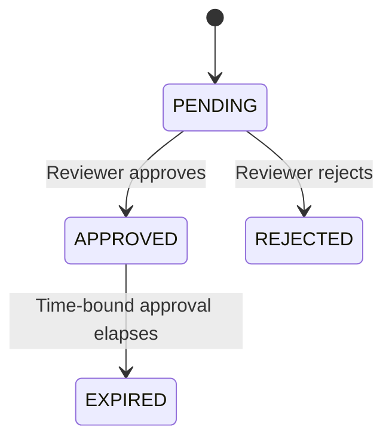

# Approvals

RunAgents approvals are **policy-driven**. A request is created when a bound policy rule evaluates to `permission: approval_required` for a tool call.

Navigate to **Approvals** in the sidebar to review, approve, or reject requests.

---

## When a request is created

A just-in-time approval request is created when all of the following are true:

1. the tool call matches the tool and operation
2. the agent has a bound policy whose matching rule resolves to `approval_required`
3. the call is blocked pending approval

A `403` is returned with `code: APPROVAL_REQUIRED`, and if the call is part of a run, the run moves to `PAUSED_APPROVAL`.

---

## Approval flow

```mermaid
flowchart TD
    call["Agent calls tool"]
    decision{"Policy decision"}
    allow["Allow call to proceed"]
    req["Create approval request<br/>Status: PENDING"]
    block["Return 403 APPROVAL_REQUIRED"]
    pause["Pause run (if run-backed)<br/>Status: PAUSED_APPROVAL"]
    review["Reviewer action<br/>(Console or API)"]
    approve["Approve request"]
    reject["Reject request"]
    scoped["Create scoped runtime approval"]
    resume["Resume blocked action"]
    rejected["Mark request REJECTED<br/>Run remains failed or blocked"]

    call --> decision
    decision -->|"allow"| allow
    decision -->|"approval_required"| req
    req --> block
    req --> pause
    pause --> review
    review --> approve
    review --> reject
    approve --> scoped
    scoped --> resume
    reject --> rejected
```

On approval, RunAgents records a scoped approval outcome and automatically resumes the blocked work.

---

## Approval choices

Depending on the operator surface, approvals can be scoped in three useful ways:

- **Once**: approve one exact blocked action
- **This run**: approve matching actions for the current run
- **Time-bound window**: approve matching actions for the same user, agent, and tool for a limited period

This lets teams keep sensitive writes tightly controlled without forcing repeated approval for safe retries or short operator work windows.

---

## Approval versus consent

Approval and consent solve different problems:

- **Approval** means a reviewer must allow a governed action
- **Consent** means an end user must grant or refresh OAuth access to a delegated-user tool

In the console, these should be treated as distinct operational states even though both may pause a run.

<figure class="ra-shot">
  
  <figcaption>The approvals queue gives reviewers a focused view of governed actions waiting for a decision, including the requesting agent, tool, and subject.</figcaption>
</figure>

---

## What you see on the Approvals page

Each request includes:

- agent
- tool
- subject (user or service identity)
- capability or operation, when available
- status (`PENDING`, `APPROVED`, `REJECTED`, `EXPIRED`)
- timestamps and approver metadata

Approving or rejecting can optionally record a reason for audit.

---

## Request lifecycle



!!! info "Automatic expiry"
    Time-bound approval windows expire automatically.

---

## Policy configuration for approvals

Use policy rules to trigger approvals:

```yaml
spec:
  policies:
    - permission: approval_required
      tags: [financial]
      operations: [POST]
```

Use policy approval rules to define who can approve and how requests are delivered:

```yaml
spec:
  approvals:
    - tags: [financial]
      approvers:
        groups: [finance-approvers]
        match: any
      defaultDuration: 4h
      delivery:
        connectors: [slack-finance]
        mode: first_success
        fallbackToUI: true
```

---

## Connectors

Approval requests can be dispatched to external systems such as:

- Slack
- PagerDuty
- Microsoft Teams
- Jira

Configure connectors in **Settings → Approval Connectors**, then reference connector IDs in policy approval delivery.

---

## Run integration

For run-backed calls:

1. the request is created and the run becomes `PAUSED_APPROVAL`
2. the operator approves or rejects the request
3. the blocked action is updated
4. the resume worker replays the blocked action automatically
5. the run continues without the end user manually retrying

This preserves auditability for who approved what, when, and for which run or action.

---

## Next steps

| Goal | Where to go |
|------|------------|
| Understand policy semantics | [Policy Model](../concepts/policy-model.md) |
| Register tools safely | [Registering Tools](registering-tools.md) |
| Review run-level behavior | [Run Lifecycle](../operations/runs.md) |
| Configure approver identity | [Identity Providers](identity-providers.md) |
