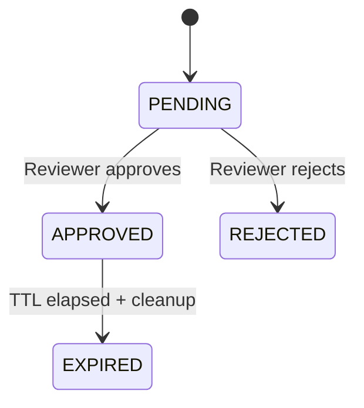

# Approvals

RunAgents approvals are **policy-driven**. A request is created when a bound policy rule evaluates to `permission: approval_required` for a tool call.

Navigate to **Approvals** in the sidebar to review, approve, or reject requests.

---

## When A Request Is Created

A JIT approval request is created when all of the following are true:

1. The tool call matches the tool and operation.
2. The agent has a bound policy whose matching rule resolves to `approval_required`.
3. The call is blocked pending approval.

A `403` is returned with `code: APPROVAL_REQUIRED`, and if the call is part of a run, the run moves to `PAUSED_APPROVAL`.

---

## Approval Flow

```mermaid
flowchart TD
    call["Agent calls tool"]
    decision{"Policy decision"}
    allow["Allow call to proceed"]
    req["Create approval request<br/>Status: PENDING"]
    block["Return 403 APPROVAL_REQUIRED"]
    pause["Pause run (if run-backed)<br/>Status: PAUSED_APPROVAL"]
    review["Reviewer action<br/>(Console or Connector)"]
    approve["Approve request"]
    reject["Reject request"]
    grant["Create temporary allow grant<br/>(TTL-bound)"]
    resume["Resume blocked action"]
    rejected["Mark request REJECTED<br/>Run remains failed/blocked"]

    call --> decision
    decision -->|"allow"| allow
    decision -->|"approval_required"| req
    req --> block
    req --> pause
    pause --> review
    review --> approve
    review --> reject
    approve --> grant
    grant --> resume
    reject --> rejected
```

On approval, RunAgents creates a temporary allow grant with TTL (default 4h unless overridden), then resumes the blocked action.

---

## What You See In The Approvals Page

Each request includes:

- agent
- tool
- subject (user/service identity)
- capability / operation (when available)
- status (`PENDING`, `APPROVED`, `REJECTED`, `EXPIRED`)
- timestamps and approver metadata

Approving or rejecting optionally records a reason for audit.

---

## Request Lifecycle



!!! info "Automatic expiry"
    Approved access is time-limited. Expired grants are automatically cleaned up.

---

## Policy Configuration For Approvals

Use policy rules to trigger approvals:

```yaml
spec:
  policies:
    - permission: approval_required
      tags: [financial]
      operations: [POST]
```

Use policy approval rules to define who can approve and how requests are delivered:

```yaml
spec:
  approvals:
    - tags: [financial]
      approvers:
        groups: [finance-approvers]
        match: any
      defaultDuration: 4h
      delivery:
        connectors: [slack-finance]
        mode: first_success
        fallbackToUI: true
```

---

## Connectors

Approval requests can be dispatched to external systems:

- Slack
- PagerDuty
- Microsoft Teams
- Jira

Configure connectors in **Settings → Approval Connectors**, then reference connector IDs in policy approval delivery.

---

## Run Integration

For run-backed calls:

1. Request is created and run becomes `PAUSED_APPROVAL`.
2. Approval updates blocked action status.
3. Resume worker replays the blocked action.
4. Run continues without manual retry from the end user.

This preserves full auditability for who approved what, when, and for which run/action.

---

## Next Steps

| Goal | Where to go |
|------|------------|
| Understand policy semantics | [Policy Model](../concepts/policy-model.md) |
| Register tools safely | [Registering Tools](registering-tools.md) |
| Review run-level behavior | [Run Lifecycle](../operations/runs.md) |
| Configure approver identity | [Identity Providers](identity-providers.md) |
